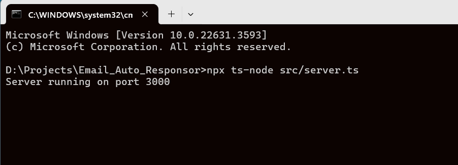
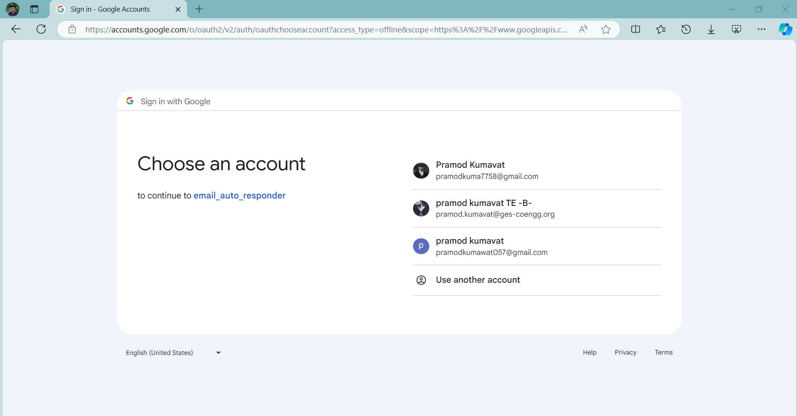
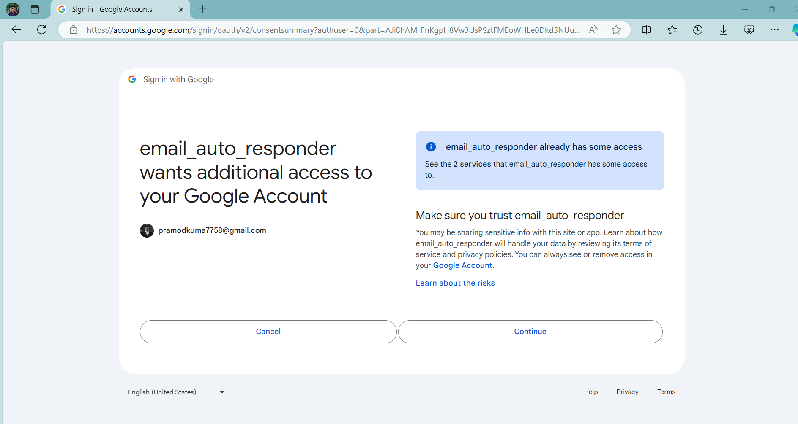
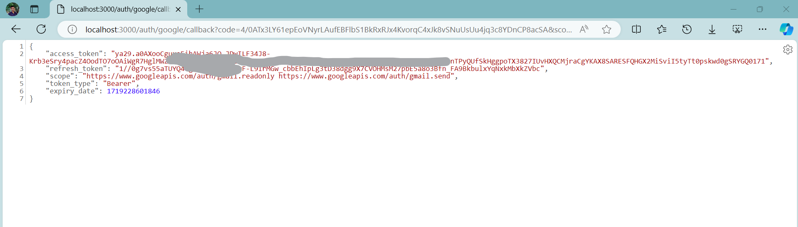

# Email Auto Responsor

## Description
The Email Auto Responsor is a tool designed to automatically parse and respond to emails based on their content using AI. It integrates with Gmail and Outlook APIs, categorizes emails, and generates appropriate responses.

## Features
- OAuth2 authentication with Gmail and Outlook
- Parsing emails and categorizing them using OpenAI
- Automated response generation based on email context
- Integration with BullMQ for task scheduling

## Technologies Used
  - TypeScript
  - OpenAi API
  - Google OAuth API
  - Outlook OAuth API

## Getting Started
  Follow the below steps: 
## Installation
1. **Initialize TypeScript Project**
```bash
mkdir Email_Auto_Responsor
cd Email_Auto_Responsor
npm init -y
npm install typescript ts-node nodemon @types/node
npx tsc --init
```

**OR**
**Clone the repository**
  ```bash
  git clone <https://github.com/PramodKumavat7758/Email_Auto_Responsor.git>
```

2. **Install Required Packages**
```bash
npm install
npm install express axios google-auth-library @microsoft/microsoft-graph-client msal openai bullmq ioredis
npm install @types/express @types/axios
```
3. **Start the server**
   
```bash
npx ts-node src/server.ts
```

4. **Authenticate and obtain the tokens**
   - Open your browser and navigate to http://localhost:3000//auth/google
     
     
   - Follow the OAuth flow and obtain tokens
     
     
     
   - Start processing emails.

## Contributing
Contributions are welcome! Please open an issue or submit a pull request.

## License
[MIT License](LICENSE)
